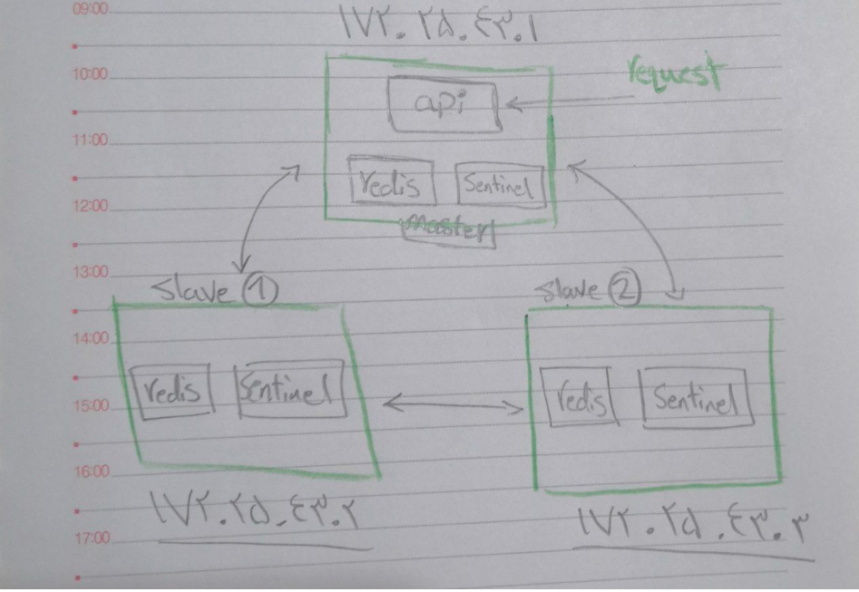

# redis_sentinel
   

# overview

* test scenario with redis and redis.sentinel and an api to accept requests
* the api gets the master from sentinels whenever it wants to interact with redis 
* redis master , slave and sentinels composes and configs are [here](./redis-composes/)
* the api is written with `FastAPI` 

# steps 

* first we configure the master and slave redises (run in tmux to see the logs as well)
```
docker-compose -f master-compose.yml up
docker-compose -f slave-1-compose.yml up
docker-compose -f slave-2-compose.yml up
```
* then start the sentinels
```
docker-compose -f sentinels-compose.yml up
```
* you can either run the api , or build the image and run it inside a container(recommended)
```
docker build . -t arpjoker/gos/redisapi
docker run --network sentinel --rm -p 8080:80 arpjoker/gos/redisapi:latest 
```
# test

```
curl -X POST -H "Content-Type: application/json" -d '{"key": "ali", "value":"kocholo"}' localhost:8080/set
curl localhost:8080/get/ali

```

* this is for local test purposes , 3 nodes are needed for a robust deployment

    
    
    * PS: deploy the api on all nodes , its not in the picture

* make a pull request if you see it fit this scenario